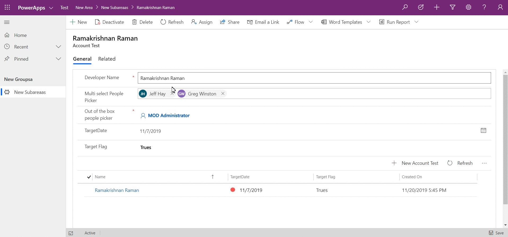

# OfficeUIFabricReactPeoplePicker

A PCF component for Multi select people picker. 

This solution give the ability to select multiple members from the people picker. It works on the User(system) entity of common data services.

## Usage

Option 1 - Import the zip file directly into CDS. Managed or Unmanaged Solution.

Option 2 
- git clone the repo
- npm install
- npm run build

## Glimpse of the sample 

## For packaging & deploying the solution, refer the below link

 https://docs.microsoft.com/en-us/powerapps/developer/component-framework/import-custom-controls 

## Solution

Solution|Author(s)
--------|---------
OfficeUIFabricReactPeoplePicker|Ramakrishnan Raman

## Disclaimer

**THIS CODE IS PROVIDED *AS IS* WITHOUT WARRANTY OF ANY KIND, EITHER EXPRESS OR IMPLIED, INCLUDING ANY IMPLIED WARRANTIES OF FITNESS FOR A PARTICULAR PURPOSE, MERCHANTABILITY, OR NON-INFRINGEMENT.**
